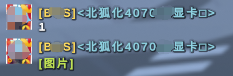

<p align="center">
  <a href="https://github.com/beihuNF/QQ2UnPlugin">
    
  </a>
</p>

<div align="center">

# QQ2UnPlugin

_✨ 基于 [RocketMod](https://github.com/RocketMod/Rocket) 的QQ消息游戏内显示插件 ✨_  


</div>

## 引用
- [`RestoreMonarchyPlugins/RichMessageAnnouncer`](https://github.com/RestoreMonarchyPlugins/RichMessageAnnouncer): 引用此项目,并做了一些改动.

## 功能
> [x] QQ消息游戏内显示\
> [x] 进服欢迎消息\
> [x] 丰富的文本样式和变量支持

## 使用方法
### Unturned端
1. 下载编译好的"QQ2UnPlugin.dll"并放进`Rocket/Plugins`文件夹中
2. 运行服务器生成配置文件
3. 修改配置文件中的`Port`为自己想要的端口号

### QQ端
- 编写插件获取QQ消息并传递
<details><summary>代码示例 点击展开</summary>

```python
import requests
import json

def send_to_unturned(message, url=None):
    server_url = "http://[ip]:[端口号]/api/qq-un"  # 替换成你的服务器地址和端口
    headers = {"Content-Type": "application/json; charset=utf-8"}
    
    payload = {"message": message}
    if url:
        payload["url"] = url

    response = requests.post(server_url, data=json.dumps(payload), headers=headers)
    print("服务器响应：", response.text)

prefix = "[群名]"
name = "玩家名"
text = "测试"
icon_url = "http://example.com/avatar.png" #替换成需要的图片或获取QQ头像

msg = f"{prefix}{name}: {text}"
send_to_unturned(msg, icon_url)
```

</details>

> [!NOTE]
> 仅提供了基础的消息发送示例,实际内容需根据qq框架进行相应的更改

## 预览图



## 变量
| 变量      | 含义                       |
| --------- | -------------------------- |
| {player_name}      | 玩家名             |
| {player_id}        | 玩家 steam id      |
| {server_name}      | 服务器名            |
| {server_players}   | 在线玩家数量         |
| {server_maxplayers}| 服务器最大玩家数量    |
| {server_map}       | 服务器地图           |
| {server_mode}      | 服务器模式 (PVP/PVE) |
| {server_thumbnail} | 服务器缩略图         |
| {server_icon}      | 服务器图标           |

## 文本样式
| 示例      | 参数                       |
| --------- | -------------------------- |
| **加  粗**      | `{b}加粗/b}`             |
| *倾  斜*        | `{i}倾斜{/i}`      |
| <font color=#008000>绿色</font>      | `{color=#008000}颜色{/color}`           |
| <font size=5>大小</font>      | `{size=5}大小{/size}`            |

## 配置文件
```xml
<?xml version="1.0" encoding="utf-8"?>
<QQ2UnPluginConfiguration xmlns:xsd="http://www.w3.org/2001/XMLSchema" xmlns:xsi="http://www.w3.org/2001/XMLSchema-instance">
  <Port>8080</Port>
  <MessageColor>white</MessageColor>
  <MessageIconUrl>{server_icon}</MessageIconUrl>
  <Messages>
    <Message Text="Format examples: {b}文字加粗{/b}, {color=#e74c3c}文字颜色{/color}, {size=20}文字大小{/size}", "{server_icon}", "white" />
  </Messages>
  <EnableWelcomeMessage>true</EnableWelcomeMessage>
  <WelcomeMessage Text="{size=18}欢迎来到服务器 {b}{player_name}{/b}!", "{server_icon}", "white" />
</QQ2UnPluginConfiguration>
```